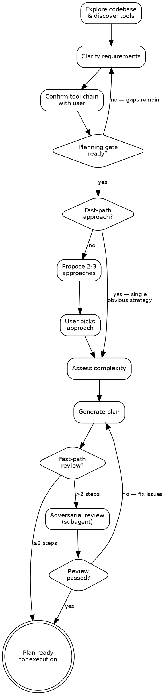

# Blueprint Skill

## Purpose

Produce collaborative implementation plans as written artifacts, where every step follows a build-review-verify cycle. Transform vague feature requests, architectural changes, or refactoring goals into concrete, sequenced plans that a human or agent can execute step by step. Treat planning as a dialogue — explore the codebase, discover tooling, ask questions, compare approaches, assess complexity, then generate the plan.

## Effort Level

Scale exploration depth to task complexity, but always err toward more thoroughness. Read broadly before narrowing — the goal is a plan that surfaces zero surprises during execution.

## Anti-pattern: "Too Simple to Plan"

Even a one-line change carries assumptions about where it goes, what it affects, and how it gets verified. "Simple" tasks are precisely where unexamined assumptions cause wasted rework — the build-review-verify structure catches those before they compound. A plan can be a single step with one acceptance criterion; the fast-path for small plans (≤2 steps) already keeps overhead minimal. The anti-pattern is skipping planning entirely, not the plan's size.

## Design Principles

### Prose Over Code

Plan steps describe intent in prose. Do not include code blocks except for interface signatures, config keys, and schema shapes (full policy in `references/step-template.md`). Tool commands in Phase 3 checklists are operational instructions, not code — they are always permitted.

## Workflow



<PLANNING-GATE>
Do not begin plan generation until: (1) the user has confirmed the discovered tool chain, and (2) all critical ambiguities surfaced during clarification have been resolved. An ambiguity is critical if resolving it differently would change the plan's structure, step count, or chosen approach. Proceeding without both produces plans built on guesswork.
</PLANNING-GATE>

### 1. Understand the Task and Discover Tooling

Begin by reading the codebase broadly. Examine:

- Project structure (directories, modules, packages).
- Entry points (main files, route definitions, CLI commands).
- Data layer (models, schemas, migrations, repositories).
- Configuration (settings files, environment variables, feature flags).
- Existing tests (test structure, fixtures, factories, coverage).
- Documentation (architecture docs, ADRs, READMEs with setup instructions).

**While exploring, discover project tooling.** Tool discovery is not a separate phase — it happens naturally during codebase exploration. As configuration files, CI pipelines, and lock files are encountered, record the test runner, linter, formatter, type checker, and package manager they imply. See `references/tool-discovery.md` for the full per-language lookup table and detection methodology. When CI pipeline commands conflict with config file commands, prefer the CI commands — they reflect what actually runs.

Then ask clarifying questions. Focus on:

- What the user actually wants (not what they said — these sometimes differ).
- What constraints exist that are not visible in the code.
- What the definition of done looks like for this work.
- Whether there are related changes planned that this should accommodate.

Iterate on understanding. Summarize what has been gathered so far, identify gaps, and ask follow-up questions. Two to three rounds of clarification is normal for non-trivial plans. For simple, well-defined tasks, one round may suffice.

When planning involves architectural decisions that benefit from diagrams or visual comparison of approaches, the superpowers plugin's visual companion can render these in a browser. This capability requires the superpowers plugin to be installed; no fallback is provided if it is absent.

**Required deliverable before proceeding**: Present the discovered tool chain to the user for confirmation. Format it as a numbered list with the source of each discovery in parentheses. The user may confirm, add, remove, or reorder tools. Do not proceed to step 2 until the tool chain is confirmed. Example:

```
Discovered tools for this project:

1. Package manager: uv (from uv.lock)
2. Test runner: pytest (from pyproject.toml [tool.pytest])
3. Linter: ruff check . (from pyproject.toml [tool.ruff])
4. Formatter: ruff format --check . (from pyproject.toml [tool.ruff.format])
5. Type checker: mypy . (from pyproject.toml [tool.mypy])

Add, remove, or reorder? (or confirm to proceed)
```

**Fast-path for small plans**: If the user's request is narrowly scoped (e.g., a config change, single-file refactoring, or other small task that will clearly result in 2 or fewer steps), discover tools as normal but present them inline with the generated plan rather than as a separate confirmation gate. Still include the tool chain table in the plan header. For plans with 3 or more steps, or architecturally significant plans, keep the separate confirmation step described above.

### 2. Propose Approaches

Once the task is understood and tooling confirmed, outline 2-3 candidate implementation strategies before locking in a plan structure. For each, describe the approach in a sentence or two and call out its key trade-offs — what it optimizes for, what it sacrifices, and where it carries risk. Open with the strategy you recommend and explain the reasoning; then present the alternatives so the user can make an informed choice. Wait for the user to select an approach before moving to complexity assessment and plan generation.

**Fast-path**: When the task is narrowly scoped and only one credible strategy exists, state it briefly and move on — inventing artificial alternatives wastes time and muddies the conversation.

### 3. Assess Complexity

With the approach selected, determine the plan's scope:

- Count the anticipated steps. Each step should represent a single logical unit of work — larger than a trivial config change, smaller than a full feature. If it can be described in one sentence, merge it with an adjacent step. If it needs its own sub-plan, split it.
- Evaluate whether natural milestones exist (e.g., "data layer first, then API, then UI").
- Choose the output format based on step count:
  - **5 or fewer steps, single concern**: single plan document.
  - **6-8 steps, single concern**: single document with grouped headings.
  - **Distinct phases or more than 8 steps**: milestone folder with one file per milestone.
  - **Ambiguous**: ask the user.

**Step sizing guidance**:
- Each step must be independently verifiable — all its tests pass without depending on future steps being complete.
- Steps should build on each other sequentially. Later steps may depend on earlier steps, but not the reverse.
- Avoid steps that are purely structural ("set up the directory") unless the project has no existing structure. Structural work should be folded into the first functional step.

### 4. Generate the Plan

Write the plan artifact(s) following the structure defined in `references/step-template.md`. Every step includes all three phases: Build, Adversarial Review, and Verification.

**Plan header**: Include a title, date, summary of the goal, and the confirmed tool chain.

```markdown
# Plan: [Feature/Change Title]

**Date**: YYYY-MM-DD
**Goal**: [1-2 sentence summary of what this plan achieves]

## Tool Chain

| Category | Tool | Command |
|---|---|---|
| Test runner | [discovered] | `[test command]` |
| Linter | [discovered] | `[lint command]` |
| Type checker | [discovered] | `[type-check command]` |
| Formatter | [discovered] | `[format command]` |

## Steps

[Steps follow here, each using the 3-phase template]
```

**Step generation rules**:

- Number steps sequentially starting from 1.
- Write clear, specific titles that describe the deliverable ("Add user authentication endpoint"), not the activity ("Work on authentication").
- Write acceptance criteria that are concrete and testable. Avoid vague criteria like "code is clean" or "performance is good." Use measurable conditions: "Response time under 200ms for 95th percentile," "All validation errors return 422 with field-level messages."
- In Phase 1 (Build), describe intent per the prose-first approach. Specify what to create, modify, and test. Reference existing code patterns where applicable ("Follow the same repository pattern used in `src/repos/product_repo.py`").
- In Phase 2 (Adversarial Review), write step-specific review questions targeting the most likely failure modes, but also include broader integration questions: Does this change fit naturally in the existing codebase? Does it follow established conventions and patterns? Could it break or degrade anything outside its immediate scope? The review is a thorough, critical code review of the work done — not just an acceptance criteria checklist. The goal is to eliminate all issues introduced by the build phase before proceeding.
- In Phase 3 (Verification), include the full checklist with tool commands from the confirmed tool chain. Add step-specific verification items beyond the standard checks.

**Dependency tracking**: If a step depends on artifacts from a previous step, state the dependency explicitly in the objective. Example: "Depends on Step 2 (user repository). Uses the `UserRepository` interface defined there."

**Writing the milestone folder** (when applicable):

- Create one file per milestone: `01_milestone-name.md`, `02_milestone-name.md`, etc.
- Each milestone file follows the same structure (header, tool chain, steps).
- Add a root `README.md` in the plan folder that lists milestones in order with one-sentence descriptions.
- Keep milestones to 3-5 steps each. If a milestone has more, split it.

### 5. Adversarial Plan Review

After writing the plan to disk, dispatch a subagent to perform an adversarial review of the entire plan. The subagent reads the plan fresh from disk with no anchoring to the planning context — it acts as a critical second pair of eyes whose sole purpose is to find weaknesses before execution begins.

**Why a subagent**: The agent that wrote the plan is anchored to its own reasoning. A fresh subagent without the full planning conversation history reads the plan as an executor would — spotting ambiguities, gaps, and logical flaws that the author is blind to. The subagent receives only a brief scope summary (see `{{PLANNING_CONTEXT}}` below) to verify the plan addresses the user's full intent, not the entire planning dialogue.

**Fast-path for small plans**: If the plan has 2 or fewer steps and covers a narrowly scoped change (e.g., a config change, a single-file refactoring, a straightforward addition), skip the subagent dispatch. Instead, perform a quick self-review checking for obvious gaps in acceptance criteria, missing verification items, and dependency issues. Present the plan to the user and ask if they want to start execution. For plans with 3 or more steps, or any plan that touches architecture, multiple modules, or cross-cutting concerns, always dispatch the subagent — no exceptions.

**Dispatching the review subagent**: Use Claude Code's Agent tool to dispatch the plan review subagent. Reference `references/plan-review-subagent.md` for the exact prompt template. Substitute placeholders before dispatching:

- `{{PLAN_PATH}}` — absolute path to the plan file or milestone folder.
- `{{PROJECT_ROOT}}` — absolute path to the project root.
- `{{PLANNING_CONTEXT}}` — compose a brief summary (5-10 sentences) of: what the user originally asked for, key constraints and decisions from the clarification rounds, agreed scope boundaries, and any explicit exclusions ("we agreed not to handle X"). This gives the subagent enough context to verify the plan addresses the user's full intent, not just what the Goal header captured.

The subagent prompt in `references/plan-review-subagent.md` contains the full review methodology covering completeness, dependencies, sizing, criteria quality, phase quality, prose compliance, architecture, and risk.

**After the subagent returns**:

- If the review finds **no issues**: Inform the user the plan passed adversarial review and ask if they want to start execution.
- If the review finds **issues**: Present all findings to the user with the subagent's full report. The user decides whether changes are needed or the plan is acceptable as-is.
  - If the user wants changes: make the requested modifications to the plan, then offer to re-run the adversarial review on the updated plan. The user may accept another review round or decline and proceed to execution. Repeat this review-modify cycle until the user is satisfied.
  - If the user says the plan is fine: proceed to ask if they want to start execution.

Do not skip the plan review (except via the fast-path above). Do not auto-resolve findings without user input. The plan review is a hard gate — the plan is not considered complete until it has passed this step.

**After approval**: Commit the plan file to git so it persists across sessions and supports checkmark-based progress tracking.

## Output Formats

See Step 3 (Assess Complexity) for which format to choose based on step count.

### Single Document

**Path**: `docs/plans/YYYY-MM-DD-<topic>-plan.md`

Example: `docs/plans/2026-03-15-user-auth-plan.md`

### Milestone Folder

**Path**: `docs/plans/YYYY-MM-DD-<topic>/`

Contents:
```
docs/plans/2026-03-15-user-auth/
  README.md
  01_data-layer.md
  02_api-endpoints.md
  03_frontend-integration.md
```

The `README.md` provides an ordered list of milestones with summaries, the confirmed tool chain, and any cross-cutting concerns that apply to all milestones.

## Handling Plan Execution

When the user asks to execute, invoke `blueprint:execute` — it provides full subagent orchestration with batching, git handling, and progress tracking. If unavailable, work through steps one at a time completing all three phases before advancing. Mark completed steps with a checkmark in the plan heading and tick Phase 3 checkboxes for cross-session resumability. See `references/step-template.md` for what belongs in each phase of a plan step.

## Handling Scope Changes

- If scope changes during execution invalidate more than half the remaining plan, recommend starting fresh rather than patching a plan built on outdated assumptions.
- If new steps are needed during execution, propose them with the same 3-phase structure (build, adversarial review, verification) and insert them at the appropriate position in the plan.

## Additional Resources

Refer to the following reference files for detailed guidance:

- **`references/step-template.md`** — Full step template with phase-by-phase guidance and a complete example step. Use this as the structural reference for every step in every plan.
- **`references/tool-discovery.md`** — Per-language lookup tables for detecting project tooling across ecosystems. Use as a reference during codebase exploration in step 1.
- **`references/plan-review-subagent.md`** — Prompt template for the adversarial plan review subagent dispatched in step 5. Use this verbatim when dispatching the review subagent after plan generation.
